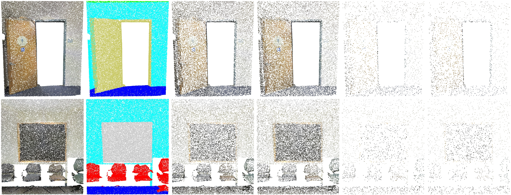
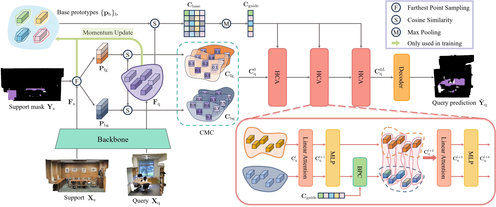

# [CVPR 2024] Rethinking Few-shot 3D Point Cloud Semantic Segmentation

*Zhaochong An, Guolei Sun<sup>†</sup>, Yun Liu<sup>†</sup>, Fayao Liu, Zongwei Wu, Dan Wang, Luc Van Gool, Serge Belongie*

Welcome to the official PyTorch implementation repository of our paper [**Rethinking Few-shot 3D Point Cloud Semantic Segmentation**](https://arxiv.org/abs/2403.00592), accepted to CVPR 2024 [\[arXiv\]](https://arxiv.org/abs/2403.00592).


# Highlight 

### The first thing we want you to be aware from this paper: 
<p align="center"><i>please ensure you are using our <strong>corrected setting</strong> for the development and evaluation of your 3D few-shot models</i>.</p>

---

<div align="center">
  
</div>

1. **Identification of Key Issues**: We pinpoint two significant issues in the current Few-shot 3D Point Cloud Semantic Segmentation (*FS-PCS*) setting: **foreground leakage** and **sparse point distribution**. These issues have undermined the validity of previous progress and hindered further advancements.
2. **Standardized Setting and Benchmark**: To rectify existing issues, we propose a **standardized *FS-PCS* setting** along with a new benchmark. This enables fair comparisons and fosters future advancements in the field. Our repository **implements an effective few-shot running pipeline** on our proposed standard *FS-PCS* setting, facilitating **easy development for future researchers based on our code base**.
<div align="center">
  
</div>

3. **Novel Method (*COSeg*)**: Our method introduces **a novel correlation optimization paradigm**, diverging from the traditional feature optimization approach used by all previous *FS-PCS* models. COSeg achieves state-of-the-art performance on both S3DIS and ScanNetv2 datasets, demonstrating effective contextual learning and background correlation adjustment ability.


# Get Started

## Environment

1. **Install dependencies**

```
pip install -r requirements.txt
```

If you have any problem with the above command, you can also install them by

```
pip install torch==1.11.0+cu113 torchvision==0.12.0+cu113 torchaudio==0.11.0 --extra-index-url https://download.pytorch.org/whl/cu113
pip install torch_points3d==1.3.0
pip install torch-scatter==2.1.1
pip install torch-points-kernels==0.6.10
pip install torch-geometric==1.7.2
pip install timm==0.9.2
pip install tensorboardX==2.6
pip install numpy==1.20.3
```

2. **Compile pointops**

Ensure you have `gcc`, `cuda`, and `nvcc` installed. Compile and install pointops2 as follows:
```
cd lib/pointops2
python3 setup.py install
```

## Datasets Preparation

You can either directly download the preprocessed dataset directly from the links provided below or perform the preprocessing steps on your own.

### Preprocessed Datasets
| Dataset | Download |
| ------------------ | -------| 
| S3DIS | [Download link](https://drive.google.com/file/d/1faJYS_sulGWdLg-Qlst9oGVKfOxZos4m/view?usp=drive_link) |
| ScanNet | [Download link](https://drive.google.com/file/d/1mUoITu4_bkucNA-Gl_Y84j0YxD93pHK0/view?usp=drive_link) |

### Preprocessing Instructions

**S3DIS**
1. **Download**: [S3DIS Dataset Version 1.2](http://buildingparser.stanford.edu/dataset.html).
2. **Preprocessing**: Re-organize raw data into `npy` files:
   ```bash
   cd preprocess
   python collect_s3dis_data.py --data_path [PATH_to_S3DIS_raw_data] --save_path [PATH_to_S3DIS_processed_data]
   ```
   The generated numpy files will be stored in `PATH_to_S3DIS_processed_data/scenes`.
3. **Splitting Rooms into Blocks**:
    ```bash
    python room2blocks.py --data_path [PATH_to_S3DIS_processed_data]/scenes
    ```


**ScanNet**
1. **Download**: [ScanNet V2](http://www.scan-net.org/).
2. **Preprocessing**: Re-organize raw data into `npy` files:
	```bash
	cd preprocess
	python collect_scannet_data.py --data_path [PATH_to_ScanNet_raw_data] --save_path [PATH_to_ScanNet_processed_data]
	```
   The generated numpy files will be stored in `PATH_to_ScanNet_processed_data/scenes`.
3. **Splitting Rooms into Blocks**:
    ```bash
    python room2blocks.py --data_path [PATH_to_ScanNet_processed_data]/scenes
    ```

After preprocessing the datasets, a folder named `blocks_bs1_s1` will be generated under `PATH_to_DATASET_processed_data`. Make sure to update the `data_root` entry in the .yaml config file to `[PATH_to_DATASET_processed_data]/blocks_bs1_s1/data`.

## Model weights
We provide the trained model weights across different few-shot settings and datasets below. 
Please note that these weights have been retrained by us, which may have slight differences from reported results.
You could directly load these weights for evaluation or train your own models following the training instructions.
| Model name         | Dataset| CVFOLD | N-way K-shot | Model Weight |
| ------------------ | -------| ------|-----|----------------------------------- |
| **s30_1w1s**       | S3DIS  | 0 | 1-way 1-shot | [Download link](https://drive.google.com/drive/u/1/folders/1AZN1yqXL6gJSDa3dEw9i2fKHFDq3WOHQ)          |
| **s30_1w5s**       | S3DIS  | 0 | 1-way 5-shot |[Download link](https://drive.google.com/drive/u/1/folders/1mYOTxutWTnMtSj8DmfG62WRZZHC3wkNA)     |
| **s30_2w1s**       | S3DIS| 0 | 2-way 1-shot | [Download link](https://drive.google.com/drive/u/1/folders/18i4dzazWJQiv1NwsaaEpBNdReILjargm)      |
| **s30_2w5s**       | S3DIS| 0 | 2-way 5-shot | [Download link](https://drive.google.com/drive/u/1/folders/1hW6E7TeB254AqPW9pNCs4GiFiEO6Ayyy)      |
| **s31_1w1s**       | S3DIS  | 1 | 1-way 1-shot | [Download link](https://drive.google.com/drive/u/1/folders/1goxoSOizSlHvtXFLCB2YkKOIGdUG5fy3)          |
| **s31_1w5s**       | S3DIS  | 1 | 1-way 5-shot |[Download link](https://drive.google.com/drive/u/1/folders/1dan3IFUl_onDIvcV8yYMHc9lXY8vovTE)     |
| **s31_2w1s**       | S3DIS| 1 | 2-way 1-shot | [Download link](https://drive.google.com/drive/u/1/folders/1UTbKNQhW2Fi_naEpTNAZMEzybjASfjkz)      |
| **s31_2w5s**       | S3DIS| 1 | 2-way 5-shot | [Download link](https://drive.google.com/drive/u/1/folders/173a8C99nl885DmNhMcQzE_YiNwCJoaPW)      |
| **sc0_1w1s**       | ScanNet  | 0 | 1-way 1-shot | [Download link](https://drive.google.com/drive/u/1/folders/1NS580I5xFEeq57tg1FqiQ7qy9eFTpIRP)          |
| **sc0_1w5s**       | ScanNet  | 0 | 1-way 5-shot |[Download link](https://drive.google.com/drive/u/1/folders/10-e7mtWF0jSeOQgvfgLiuNvrj9jE-lqZ)     |
| **sc0_2w1s**       | ScanNet| 0 | 2-way 1-shot | [Download link](https://drive.google.com/drive/u/1/folders/1-NigOn99yizUjuufzZgOM89hzDsffXAY)      |
| **sc0_2w5s**       | ScanNet| 0 | 2-way 5-shot | [Download link](https://drive.google.com/drive/u/1/folders/1-mRzqoHr-74XW17rFwXR3lSJwVgRJUO6)      |
| **sc1_1w1s**       | ScanNet  | 1 | 1-way 1-shot | [Download link](https://drive.google.com/drive/u/1/folders/1bxanSUbkWsgPSVnXW_Ce5gn_Ci3kkI6j)          |
| **sc1_1w5s**       | ScanNet  | 1 | 1-way 5-shot |[Download link](https://drive.google.com/drive/u/1/folders/1KpBmSkMt7-6V5JfOOF09kW8G-ibazYdj)     |
| **sc1_2w1s**       | ScanNet| 1 | 2-way 1-shot | [Download link](https://drive.google.com/drive/u/1/folders/1YVjJ6MnbN9HWnKTD6RJo89PH_BmXevB8)      |
| **sc1_2w5s**       | ScanNet| 1 | 2-way 5-shot | [Download link](https://drive.google.com/drive/u/1/folders/1afw6iAY8Q_R2uZiijbw4xvZALtrKm61f)      |

## Backbone pretraining
To begin, you will need to pretrain the backbone either on the S3DIS or ScanNet dataset. For consistency and ease of reproduction, we highly recommend using our pretrained backbone weights directly. You can find the pretrained weights and their corresponding download links below:

| Model name         | Dataset| CVFOLD|Model Weight                                               |
| ------------------ | -------| ------|---------------------------------------- |
| **s3_s1pre**       | S3DIS  | 1 |[Download link](https://drive.google.com/file/d/1zP2H3if2qEoXDe759WuCw9JJXeYbfHf2/view?usp=drive_link)          |
| **s3_s0pre**       | S3DIS  | 0 |[Download link](https://drive.google.com/file/d/1DyWv1PohFnGtX02lo2jcg09MEd7N9bVN/view?usp=drive_link)     |
| **sc_s1pre**       | ScanNet| 1 |[Download link](https://drive.google.com/file/d/1aeqEEckyo9v4ku5Bo6ixyXNm_Z2GmOQ9/view?usp=drive_link)      |
| **sc_s0pre**       | ScanNet| 0 |[Download link](https://drive.google.com/file/d/1RnWt3vshsrBrXaZ5Dlmz0RD6UQeReFwF/view?usp=drive_link)      |

Alternatively, you can perform the pretraining on your own. However, please note that doing so may result in more variability compared to the results reported in our paper.

To pretrain the backbone from scratch, run the following command, replacing `[PRETRAIN_CONFIG]` with the respective configuration file (`s3dis_stratified_pretraining.yaml` or `scannetv2_stratified_pretraining.yaml`), `[PATH_to_SAVE_BACKBONE]` with the desired path to save the backbone, and `[CVFOLD]` with either 0 or 1 depending on your few-shot setting:

```bash
python3 train_backbone.py --config config/[PRETRAIN_CONFIG] save_path [PATH_to_SAVE_BACKBONE] cvfold [CVFOLD]
```

## Few-shot Training
Next, let us start the few-shot training. Set the configs in `config/[CONFIG_FILE]` (`s3dis_COSeg_fs.yaml` or `scannetv2_COSeg_fs.yaml`) for few-shot training. Adjust `cvfold`, `n_way`, and `k_shot` according to your task:

```bash
# 1 way 1/5 shot
python3 main_fs.py --config config/[CONFIG_FILE] save_path [PATH_to_SAVE_MODEL] pretrain_backbone [PATH_to_SAVED_BACKBONE] cvfold [CVFOLD] n_way 1 k_shot [K_SHOT] num_episode_per_comb 1000
# 2 way 1/5 shot
python3 main_fs.py --config config/[CONFIG_FILE] save_path [PATH_to_SAVE_MODEL] pretrain_backbone [PATH_to_SAVED_BACKBONE] cvfold [CVFOLD] n_way 2 k_shot [K_SHOT] num_episode_per_comb 100
```

Note: By default, when `n_way=1`, `num_episode_per_comb` is set to `1000`. When `n_way=2`, `num_episode_per_comb` is adjusted to `100` to maintain consistency in test set magnitude.


## Testing
For testing, modify `cvfold`, `n_way`, `k_shot` and `num_episode_per_comb` accordingly, then run:
```bash
python3 main_fs.py --config config/[CONFIG_FILE] test True eval_split test weight [PATH_to_SAVED_MODEL]
```
For visualization, add `vis 1`.

Note: It is common to observe fluctuations in the mIoU by approximately 1.0%. This variability may be attributed to the relatively small size of the training set. 
The variance in performance on ScanNetv2 tends to be smaller compared to S3DIS due to its larger size. Additionally, the mean performance across the two dataset splits is generally more stable than the performance of each split individually.


# Citation
If you find this project useful, please consider giving a star :star: and citation &#x1F4DA;:

```
@article{an2024rethinking,
  title={Rethinking Few-shot 3D Point Cloud Semantic Segmentation},
  author={An, Zhaochong and Sun, Guolei and Liu, Yun and Liu, Fayao and Wu, Zongwei and Wang, Dan and Van Gool, Luc and Belongie, Serge},
  journal={arXiv preprint arXiv:2403.00592},
  year={2024}
}
```

For any questions or issues, feel free to reach out!

**Zhaochong An**: anzhaochong@outlook.com
