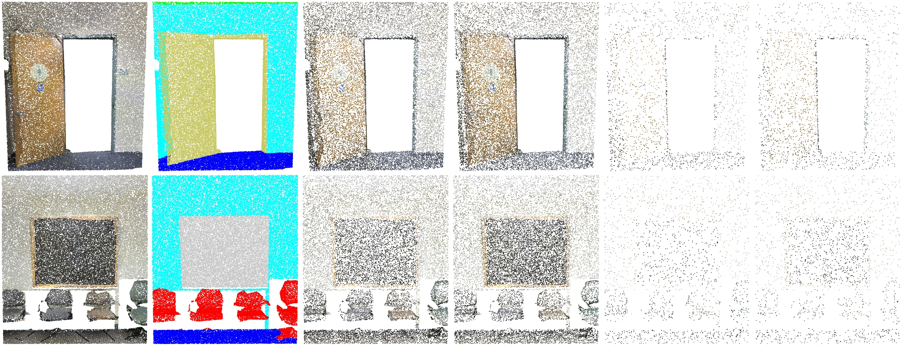
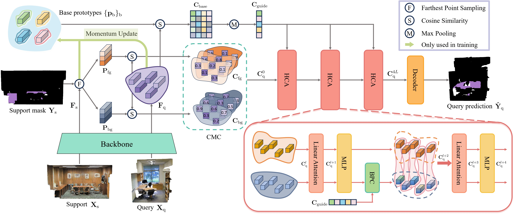

# [CVPR 2024] Rethinking Few-shot 3D Point Cloud Semantic Segmentation

*Zhaochong An, Guolei Sun, Yun Liu, Fayao Liu, Zongwei Wu, Dan Wang, Luc Van Gool, Serge Belongie*

Welcome to the official PyTorch implementation repository of our paper [**Rethinking Few-shot 3D Point Cloud Semantic Segmentation**](https://arxiv.org/abs/2403.00592), accepted to CVPR 2024. [\[arXiv\]](https://arxiv.org/abs/2403.00592)


# Highlight 
<div align="center">
  
</div>

1. **Identification of Key Issues**: We pinpoint two significant issues in the current Few-shot 3D Point Cloud Semantic Segmentation (*FS-PCS*) setting: **foreground leakage** and **sparse point distribution**. These issues have undermined the validity of previous progress and hindered further advancements.
2. **Standardized Setting and Benchmark**: To rectify existing issues, we propose a **standardized *FS-PCS* setting** along with a new benchmark. This enables fair comparisons and fosters future advancements in the field. Our repository **implements an effective few-shot running pipeline** on our proposed standard *FS-PCS* setting, facilitating **easy development for future researchers based on our code base**.
<div align="center">
  
</div>

3. **Novel Method (*COSeg*)**: Our method introduces **a novel correlation optimization paradigm**, diverging from the traditional feature optimization approach used by all previous *FS-PCS* models. COSeg achieves state-of-the-art performance on both S3DIS and ScanNetv2 datasets, demonstrating effective contextual learning and background correlation adjustment ability.


# Get Started

## Environment

1. **Install dependencies**

```
pip install -r requirements.txt
```

If you have any problem with the above command, you can also install them by

```
pip install torch==1.11.0+cu113 torchvision==0.12.0+cu113 torchaudio==0.11.0 --extra-index-url https://download.pytorch.org/whl/cu113
pip install torch_points3d==1.3.0
pip install torch-scatter==2.1.1
pip install torch-points-kernels==0.6.10
pip install torch-geometric==1.7.2
pip install timm==0.9.2
pip install tensorboardX==2.6
pip install numpy==1.20.3
```

2. **Compile pointops**

Ensure you have `gcc`, `cuda`, and `nvcc` installed. Compile and install pointops2 as follows:
```
cd lib/pointops2
python3 setup.py install
```

## Datasets Preparation

### S3DIS
1. **Download**: [S3DIS Dataset Version 1.2](http://buildingparser.stanford.edu/dataset.html).
2. **Preprocessing**: Re-organize raw data into `npy` files:
   ```bash
   cd preprocess
   python collect_s3dis_data.py --data_path [PATH_to_S3DIS_raw_data] --save_path [PATH_to_S3DIS_processed_data]
   ```
   The generated numpy files will be stored in `PATH_to_S3DIS_processed_data/scenes`.
3. **Splitting Rooms into Blocks**:
    ```bash
    python room2blocks.py --data_path [PATH_to_S3DIS_processed_data]/scenes
    ```


### ScanNet
1. **Download**: [ScanNet V2](http://www.scan-net.org/).
2. **Preprocessing**: Re-organize raw data into `npy` files:
	```bash
	cd preprocess
	python collect_scannet_data.py --data_path [PATH_to_ScanNet_raw_data] --save_path [PATH_to_ScanNet_processed_data]
	```
   The generated numpy files will be stored in `PATH_to_ScanNet_processed_data/scenes`.
3. **Splitting Rooms into Blocks**:
    ```bash
    python room2blocks.py --data_path [PATH_to_ScanNet_processed_data]/scenes
    ```

After preprocessing the datasets, a folder named `blocks_bs1_s1` will be generated under `PATH_to_DATASET_processed_data`. Make sure to update the `data_root` entry in the .yaml config file to `[PATH_to_DATASET_processed_data]/blocks_bs1_s1/data`.


## Backbone pretraining
Firstly pretrain the backbone on either S3DIS or ScanNet using the respective config files (`s3dis_stratified_pretraining.yaml` or `scannetv2_stratified_pretraining.yaml`). Additionally, note that the pretraining is conducted on one fold of the dataset. Therefore, set `cvfold` to 0 or 1 according to your few-shot setting:

```bash
python3 train_backbone.py --config config/[PRETRAIN_CONFIG] save_path [PATH_to_SAVE_BACKBONE] cvfold [CVFOLD]
```

## Few-shot Training
Next, let us start the few-shot training. Set the configs in `config/[CONFIG_FILE]` (`s3dis_COSeg_fs.yaml` or `scannetv2_COSeg_fs.yaml`) for few-shot training. Adjust `cvfold`, `n_way`, and `k_shot` according to your task:

```bash
# 1 way 1/5 shot
python3 main_fs.py --config config/[CONFIG_FILE] save_path [PATH_to_SAVE_MODEL] pretrain_backbone [PATH_to_SAVED_BACKBONE] cvfold [CVFOLD] n_way 1 k_shot [K_SHOT] num_episode_per_comb 1000
# 2 way 1/5 shot
python3 main_fs.py --config config/[CONFIG_FILE] save_path [PATH_to_SAVE_MODEL] pretrain_backbone [PATH_to_SAVED_BACKBONE] cvfold [CVFOLD] n_way 2 k_shot [K_SHOT] num_episode_per_comb 100
```

Note: By default, when `n_way=1`, `num_episode_per_comb` is set to `1000`. When `n_way=2`, `num_episode_per_comb` is adjusted to `100` to maintain consistency in test set magnitude.


## Testing
For testing, modify `cvfold`, `n_way`, `k_shot` and `num_episode_per_comb` accordingly, then run:
```bash
python3 main_fs.py --config config/[CONFIG_FILE] test True eval_split test weight [PATH_to_SAVED_MODEL]
```
For visualization, add `vis 1`.


# Citation
If you find this project useful, please consider giving a star :star: and citation &#x1F4DA;:

```
@article{an2024rethinking,
  title={Rethinking Few-shot 3D Point Cloud Semantic Segmentation},
  author={An, Zhaochong and Sun, Guolei and Liu, Yun and Liu, Fayao and Wu, Zongwei and Wang, Dan and Van Gool, Luc and Belongie, Serge},
  journal={arXiv preprint arXiv:2403.00592},
  year={2024}
}
```

For any questions or issues, feel free to reach out!

**Zhaochong An**: anzhaochong@outlook.com
